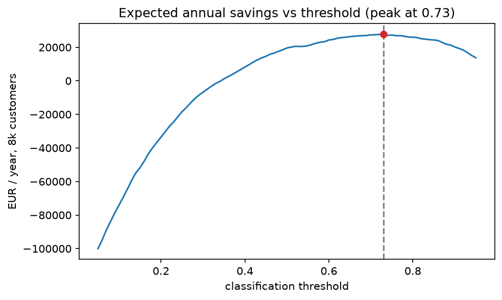
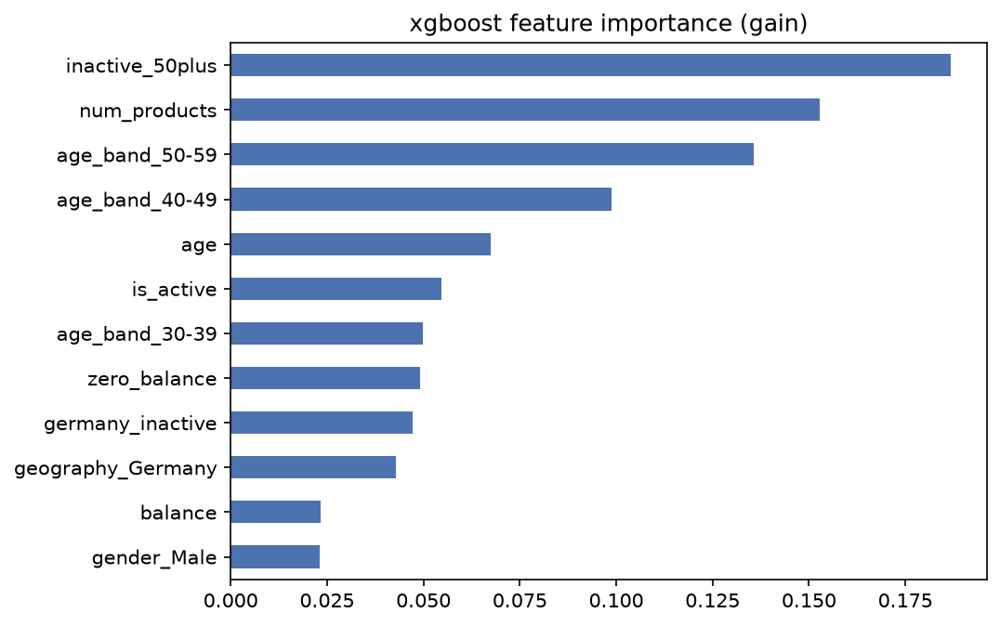

# Bank customer churn prediction

A retail bank is losing one in five customers, and the ones leaving hold 25%
more in balances than the ones staying. This project finds who leaves, what
it costs, and what a retention team should do about it.

## Key results

- 20.4% of 10,000 customers churned, taking 186M EUR in balances with them
- xgboost model: **0.887 ROC AUC / 0.743 PR AUC** on a held-out test set
- at the cost-optimal threshold it contacts 16% of the book at **73%
  precision and 57% recall**
- expected net value of deploying: about **39k EUR per year per 10k
  customers** under stated cost assumptions (30 EUR offer, 250 EUR annual
  margin, 30% offer acceptance)
- densest risk pocket: inactive customers 50+ with funded accounts. 356
  people, 84% churn, 40M EUR in balances at risk

The threshold comes from an explicit cost tradeoff, not from a default 0.5:



What drives churn (the engineered flags come straight from the EDA):



More: [executive summary](EXECUTIVE_SUMMARY.md) for the business view,
[dashboard plan](exports/README.md) for what the Tableau version will show
(published dashboard link coming once it is live on Tableau Public).

## What the bank should do

Call the inactive 50+ funded book first; that is where the model earns its
money. Treat Germany (32% churn, elevated even among active customers) as a
product and pricing review, not a marketing campaign. Dig into the 3-4 product
bundles, which churn at 86%. And test, not assume, the two-product sweet
spot: funded single-product customers are the largest at-risk pool.

## Proposed experiment

Randomize the 356 inactive, funded 50+ customers 1:1. Treatment gets a banker
call plus a 12-month fee waiver (~30 EUR per contact), control gets business
as usual. Primary metric is 6-month closure rate; the design is powered
(alpha 0.05, 80%) to detect a 15-point drop from an assumed 60% six-month
baseline, needing 173 per arm against the 178 available. Ship if the drop is
significant and cost per incrementally retained customer stays under the
250 EUR margin. Full design in [notebook 03](notebooks/03_segments.ipynb).

## Approach

SQL-first EDA against SQLite ([sql/](sql/), surfaced in
[notebook 01](notebooks/01_eda.ipynb)), then a logistic regression baseline
before random forest and xgboost ([notebook 02](notebooks/02_model.ipynb)).
Stratified 80/20 split with all tuning by 5-fold CV inside the training set;
the test set is touched once. Class weights handle the 80/20 imbalance
instead of SMOTE, keeping probabilities usable for the cost curve. Models
compared on PR AUC. Segment and experiment work in
[notebook 03](notebooks/03_segments.ipynb).

## How to run

```
python -m venv venv
venv\Scripts\pip install -r requirements.txt   # or venv/bin/pip on mac/linux
# download the csv per data/README.md, then:
python sql/load_db.py
```

Run the notebooks in order from the notebooks/ directory. Notebook 02 takes
a few minutes for the hyperparameter searches and regenerates the exports/
CSVs.
